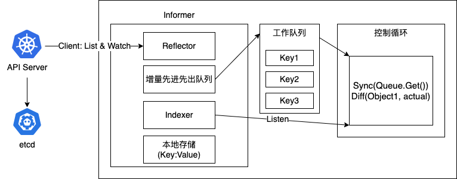
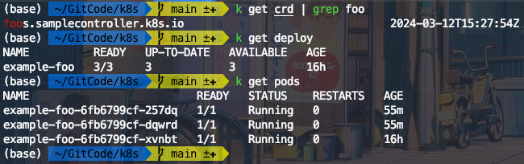
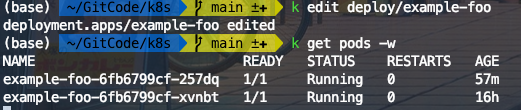
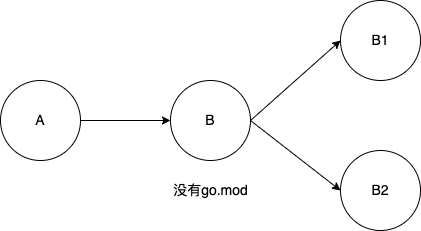

## CRD

CRD的全称是CustomResourceDefinition,是Kubernetes为提高可扩展性,
让开发者去自定义资源（如Deployment，StatefulSet等）的一种方法.

### Controller

controller是由controller-manager进行管理，通过API Server提供的接口实时监控整个集群的每一个资源对象的当前状态,
当状态发生变化时，会尝试通过CRUD操作将系统状态修复到"期望状态".

### 整理架构图



### 组件解释

Informer即自带缓存和索引机制,可以触发Handler的客户端库.使用了Reflector包,
它是一个可以通过ListAndWatch机制获取并监视API对象变化的客户端封装.

Reflector和Informer之间，用到了一个“增量先进先出队列”进行协同.
而Informer与要编写的控制循环之间，则使用了一个工作队列来进行协同.

在实际应用中,除了控制循环之外的所有代码,实际上都是 Kubernetes 为你自动生成的,
即：pkg/client/{informers, listers, clientset}里的内容。

### 源码解析

[https://jimmysong.io/kubernetes-handbook/develop/client-go-informer-sourcecode-analyse.html](https://jimmysong.io/kubernetes-handbook/develop/client-go-informer-sourcecode-analyse.html)

### 案例参考

[https://github.com/kubernetes/sample-controller](https://github.com/kubernetes/sample-controller), 注意go版本需要选用1.22

```shell
# assumes you have a working kubeconfig, not required if operating in-cluster
go build -o sample-controller .

# run sample-controller
./sample-controller -kubeconfig=$HOME/.kube/config

# create a CustomResourceDefinition
kubectl create -f artifacts/examples/crd-status-subresource.yaml

# create a custom resource of type Foo
kubectl create -f artifacts/examples/example-foo.yaml

# check deployments created through the custom resource
kubectl get deployments
```

### 案例效果



使用`k edit`调整pod实例数量



### 案例补充

> GOPATH, GOROOT, GOBIN的区别

GOPATH: Go第三方库安装路径, go mod推行后,会使用索引查询该路径下的依赖包

GOROOT: Go安装路径

GOBIN: Go可执行二进制文件安装路径

> Go Mod管理依赖解释
 
```shell
require (
	B vx.x.x
	B1 vx.x.x //indirect
	B2 vx.x.x //indirect
)
```




```shell
require (
	B vx.x.x
	B2 vx.x.x //indirect
)
```

