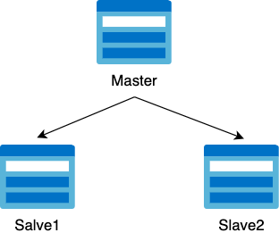
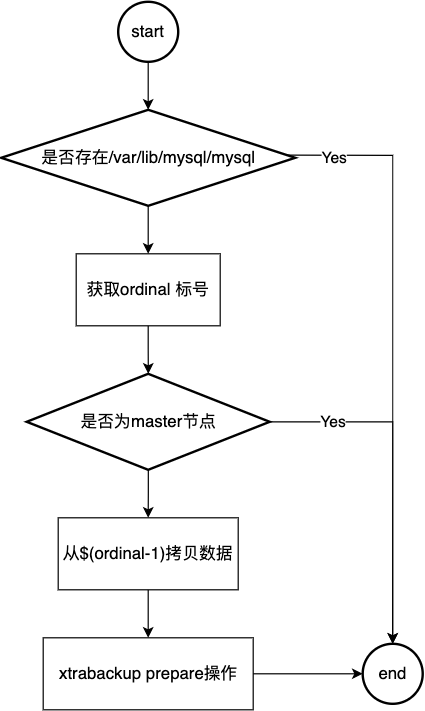
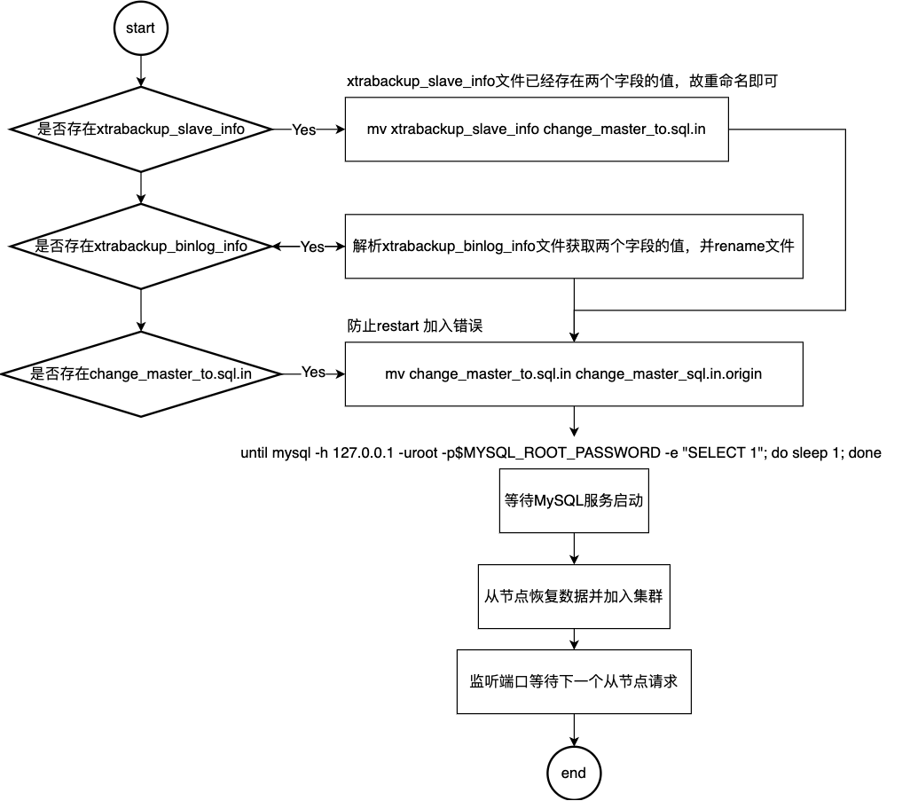

# 引言

k8s 实现主192.168.0.101从架构,读写分离的MySQL集群




## 需求

1. 一个“主从复制”的MySQL集群 
2. 有一个主节点Master 
3. 有多个从节点Slave 
4. 从节点需要能水平扩展 
5. 所以写操作只能在主节点上执行 
6. 读操作可以在所有节点上执行

## xtrabackup

见xtrabackup文件夹


### MySQL conf文件配置

由于statefulset生成的pod命名为mysql-0,mysql-1依次递增，则可以取末尾的idx作为MySQL service-id.cnf文件中的mysqld属性。

```yaml
spec:
  initContainers:
    - name: init-mysql
      image: mysql:5.7
      command:
        - bash
        - "-c"
        - |
          set -ex
          # Generate mysql server-id from pod ordinal index.
          [[ `hostname` =~ -([0-9]+)$ ]] || exit 1
          ordinal=${BASH_REMATCH[1]}
          echo [mysqld] > /mnt/conf.d/server-id.cnf
          # Add an offset to avoid reserved server-id=0 value.
          echo server-id=$((100 + $ordinal)) >> /mnt/conf.d/server-id.cnf
          # Copy appropriate conf.d files from config-map to emptyDir.
          if [[ $ordinal -eq 0 ]]; then
            cp /mnt/config-map/master.cnf /mnt/conf.d/
          else
            cp /mnt/config-map/slave.cnf /mnt/conf.d/
          fi
      volumeMounts:
        - name: conf
          mountPath: /mnt/conf.d
        - name: config-map
          mountPath: /mnt/config-map
```

### 从节点复制同步数据

```yaml
initContainers:
  - name: clone-mysql
    image: gcr.io/google-samples/xtrabackup:1.0
    command:
      - bash
      - "-c"
      - |
       set -ex
       # Skip the clone if data already exists.
       [ [ -d /var/lib/mysql/mysql ] ] && exit 0
       # Skip the clone on master (ordinal index 0).
       [[ `hostname` =~ -([0-9]+)$ ]] || exit 1
       ordinal=${BASH_REMATCH[1]}
       [[ $ordinal -eq 0 ]] && exit 0
       # Clone data from previous peer.
       ncat --recv-only mysql-$(($ordinal-1)).mysql 3307 | xbstream -x -C /var/lib/mysql
       # Prepare the backup.
       xtrabackup --prepare --target-dir=/var/lib/mysql
    volumeMounts:
      - name: data
        mountPath: /var/lib/mysql
        subPath: mysql
          - name: conf
            mountPath: /etc/mysql/conf.d
```

流程图如下：



### 从节点启动如何恢复数据

> 前提
>

xtrabackup_salve_info文件存在则说明该节点为从节点

xtrabackup_binlog_info 文件存在则说明该节点为主节点

从节点恢复数据启动主要需要获取两个字段，MASTER_LOG_FILE和MASTER_LOG_POS

```yaml
- name: xtrabackup
  image: gcr.io/google-samples/xtrabackup:1.0
  ports:
    - name: xtrabackup
      containerPort: 3307
  command:
    - bash
    - "-c"
    - |
      set -ex
      cd /var/lib/mysql
      
      # Determine binlog position of cloned data, if any.
      if [[ -f xtrabackup_slave_info ]]; then
        # XtraBackup already generated a partial "CHANGE MASTER TO" query
        # because we're cloning from an existing slave.
        mv xtrabackup_slave_info change_master_to.sql.in
        # Ignore xtrabackup_binlog_info in this case (it's useless).
        rm -f xtrabackup_binlog_info
      elif [[ -f xtrabackup_binlog_info ]]; then
        # We're cloning directly from master. Parse binlog position.
        [[ `cat xtrabackup_binlog_info` =~ ^(.*?)[[:space:]]+(.*?)$ ]] || exit 1
        rm xtrabackup_binlog_info
        echo "CHANGE MASTER TO MASTER_LOG_FILE='${BASH_REMATCH[1]}',\
              MASTER_LOG_POS=${BASH_REMATCH[2]}" > change_master_to.sql.in
      fi
      
      # Check if we need to complete a clone by starting replication.
      if [[ -f change_master_to.sql.in ]]; then
        echo "Waiting for mysqld to be ready (accepting connections)"
        until mysql -h 127.0.0.1 -uroot -p$MYSQL_ROOT_PASSWORD -e "SELECT 1"; do sleep 1; done
      
        echo "Initializing replication from clone position"
        # In case of container restart, attempt this at-most-once.
        mv change_master_to.sql.in change_master_to.sql.orig
        mysql -h 127.0.0.1 -uroot -p$MYSQL_ROOT_PASSWORD <<EOF
      $(<change_master_to.sql.orig),
        MASTER_HOST='mysql-0.mysql',
        MASTER_USER='root',
        MASTER_PASSWORD=$MYSQL_ROOT_PASSWORD,
        MASTER_CONNECT_RETRY=10;
      START SLAVE;
      EOF
      fi
      
      # Start a server to send backups when requested by peers.
      exec ncat --listen --keep-open --send-only --max-conns=1 3307 -c \
        "xtrabackup --backup --slave-info --stream=xbstream --host=127.0.0.1 --user=root"
  volumeMounts:
    - name: data
      mountPath: /var/lib/mysql
      subPath: mysql
    - name: conf
      mountPath: /etc/mysql/conf.d
  resources:
    requests:
      cpu: 100m
      memory: 100Mi
```

流程图如下



等待MySQL服务启动操作：until MySQL：Select 1