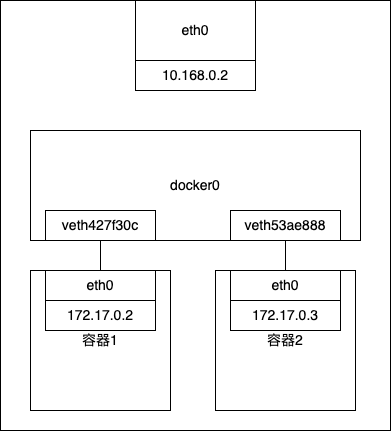
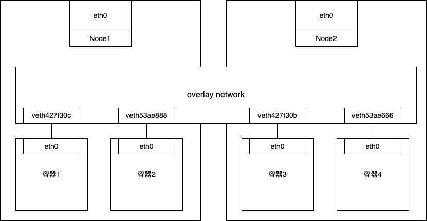
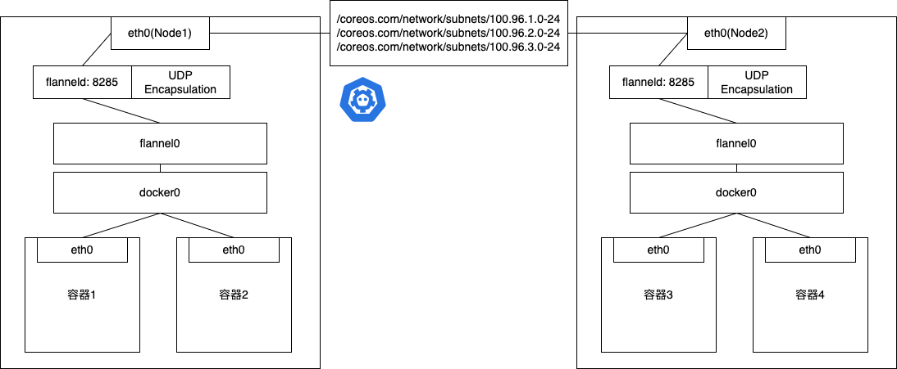

## 引言

## 网络基础

### ARP协议

是通过三层的IP地址找到对应的二层MAC地址的协议。

## K8s 单机容器网络的实现原理

docker0处理转发的过程继续扮演二层交换机的角色。此时，docker0网桥根据数据包的目的MAC地址，在它的CAM表里查到对应的端口为veth42730c，然后把数据包发往该端口，以下是该过程的原理图。



以下过程是通过iptables的TRACE功能查看数据包的传输过程。

```shell
Mar 18 20:39:20 ubun kernel: [1550900.298087] TRACE: raw:PREROUTING:policy:2 IN=docker0 OUT= PHYSIN=veth427f30c MAC=02:42:ac:11:00:03:02:42:ac:11:00:04:08:00 SRC=172.17.0.4 DST=172.17.0.3 LEN=84 TOS=0x00 PREC=0x00 TTL=64 ID=45798 PROTO=ICMP TYPE=0 CODE=0 ID=3 SEQ=6 

Mar 18 20:39:20 ubun kernel: [1550900.298092] TRACE: filter:FORWARD:rule:1 IN=docker0 OUT=docker0 PHYSIN=veth427f30c PHYSOUT=veth53ae888 MAC=02:42:ac:11:00:03:02:42:ac:11:00:04:08:00 SRC=172.17.0.4 DST=172.17.0.3 LEN=84 TOS=0x00 PREC=0x00 TTL=64 ID=45798 PROTO=ICMP TYPE=0 CODE=0 ID=3 SEQ=6 
```

## K8s 容器跨主机网络

### overlay network
根据上面的思路，需要在已有的宿主机网络上再通过软件构建一个可以把所有容器连通起来的虚拟网络即虚拟网络，原理如下图所示。



### flannel-UDP后端实现

UDP模式是最早支持的一种方式，也是性能最差的。

> 环境需求

宿主机Node1上有一个容器container-1，它的IP地址是100.96.1.2，对应的docker0网桥的地址是：100.96.1.1/24。

宿主机Node2上有一个容器container-2，它的IP地址是100.96.2.3，对应的docker0网桥的地址是：100.96.2.1/24。

```shell
default via 10.168.0.1 dev eth0
100.96.0.0/16 dev flannel0 proto kernel scope link src 100.96.1.0
100.96.1.0/24 dev docker0 proto kernel scope link src 100.96.1.1
10.168.0.0/24 dev eth0 proto kernel scope link src 10.168.0.2
```

TUN设备是一种工作在三层(Network Layer)的虚拟网络设备。TUN设备的功能非常简单，即：在操作系统内核和用户应用程序之间传递IP包。

当IP包从容器经过docker出现在宿主机，然后根据路由表进入flannel0设备后，宿主机上的flanneld收到这个包。然后看到这个IP包的DST=100.96.2.3，就将其发送给了Node2宿主机。

> 子网与宿主机的对应关系，保存在ETCD中

```shell
$ etcdctl ls /coreos.com/network/subnets
/coreos.com/network/subnets/100.96.1.0-24
/coreos.com/network/subnets/100.96.2.0-24
/coreos.com/network/subnets/100.96.3.0-24
```

即flanneld在收到container-1发给container-2的IP包之后，就会把这个IP包直接封装在一个UDP包里，然后发送给Node2。

每台宿主机上的flanneld，都监听着一个8285端口，所以flanneld只要把UDP包发往Node2的8285端口即可。后续解析步骤同单机容器网络的实现原理。



## 参考资料

- [https://www.zhihu.com/question/35655547](https://www.zhihu.com/question/35655547)
- [https://book.douban.com/subject/35424872/](https://book.douban.com/subject/35424872/)