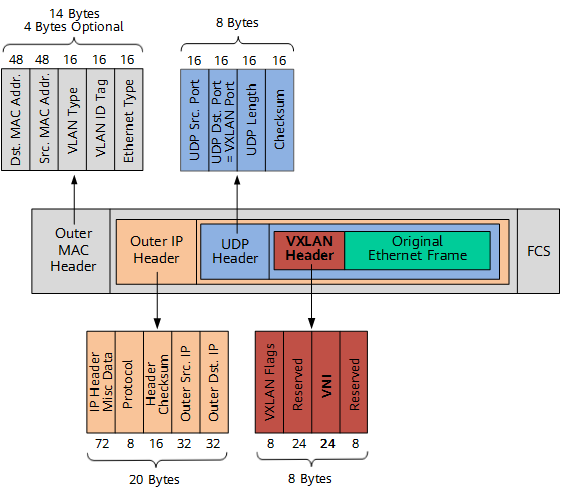

## 引言

## 网络基础

### IP 组成

IP 地址由两部分组成，即网络地址和主机地址。网络地址表示其属于互联网的哪一个网络，主机地址表示其属于该网络中的哪一台主机。二者是主从关系。

> 网络地址

网络地址用于表示设备所在网络本身。网络号部分不变，主机号部分为全“0”（二进制）的 IP 地址称为网络地址。 如主机 129.5.1.1（B 类）所在网络的网络地址是 129.5.0.0。

> 广播地址

广播地址用于向同一网络中的所有设备进行广播。网络号部分不变，而主机号部分为全“1”（二进制）的 IP 地址称 为广播地址。

### ARP 协议

是通过三层的 IP 地址找到对应的二层 MAC 地址的协议。

### VXLAN

VXLAN 本质上是一种隧道封装技术，它使用 TCP/IP 协议栈的惯用手法“封装/解封装技术”，将 L2 的以太网帧（Ethernet frames）封装成 L4 的 UDP 数据报，然后在 L3 的网络中传输，效果就像 L2 的以太网帧在一个广播域中传输一样，不再受数据中心传输的限制。
相关原理参考 [https://thebyte.com.cn/content/chapter1/vxlan.html](https://thebyte.com.cn/content/chapter1/vxlan.html)。

## K8s 单机容器网络的实现原理

docker0 处理转发的过程继续扮演二层交换机的角色。此时，docker0 网桥根据数据包的目的 MAC 地址，在它的 CAM 表里查到对应的端口为 veth42730c，然后把数据包发往该端口，以下是该过程的原理图。


以下过程是通过 iptables 的 TRACE 功能查看数据包的传输过程。

```shell
Mar 18 20:39:20 ubun kernel: [1550900.298087] TRACE: raw:PREROUTING:policy:2 IN=docker0 OUT= PHYSIN=veth427f30c MAC=02:42:ac:11:00:03:02:42:ac:11:00:04:08:00 SRC=172.17.0.4 DST=172.17.0.3 LEN=84 TOS=0x00 PREC=0x00 TTL=64 ID=45798 PROTO=ICMP TYPE=0 CODE=0 ID=3 SEQ=6

Mar 18 20:39:20 ubun kernel: [1550900.298092] TRACE: filter:FORWARD:rule:1 IN=docker0 OUT=docker0 PHYSIN=veth427f30c PHYSOUT=veth53ae888 MAC=02:42:ac:11:00:03:02:42:ac:11:00:04:08:00 SRC=172.17.0.4 DST=172.17.0.3 LEN=84 TOS=0x00 PREC=0x00 TTL=64 ID=45798 PROTO=ICMP TYPE=0 CODE=0 ID=3 SEQ=6
```

## K8s 容器跨主机网络

### overlay network

根据上面的思路，需要在已有的宿主机网络上再通过软件构建一个可以把所有容器连通起来的虚拟网络即虚拟网络，原理如下图所示。


### flannel-UDP 后端实现

UDP 模式是最早支持的一种方式，也是性能最差的。

> 环境需求

宿主机 Node1 上有一个容器 container-1，它的 IP 地址是 100.96.1.2，对应的 docker0 网桥的地址是：100.96.1.1/24。

宿主机 Node2 上有一个容器 container-2，它的 IP 地址是 100.96.2.3，对应的 docker0 网桥的地址是：100.96.2.1/24。

```shell
default via 10.168.0.1 dev eth0
100.96.0.0/16 dev flannel0 proto kernel scope link src 100.96.1.0
100.96.1.0/24 dev docker0 proto kernel scope link src 100.96.1.1
10.168.0.0/24 dev eth0 proto kernel scope link src 10.168.0.2
```

TUN 设备是一种工作在三层(Network Layer)的虚拟网络设备。TUN 设备的功能非常简单，即：在操作系统内核和用户应用程序之间传递 IP 包。

当 IP 包从容器经过 docker 出现在宿主机，然后根据路由表进入 flannel0 设备后，宿主机上的 flanneld 收到这个包。然后看到这个 IP 包的 DST=100.96.2.3，就将其发送给了 Node2 宿主机。

> 子网与宿主机的对应关系，保存在 ETCD 中

```shell
$ etcdctl ls /coreos.com/network/subnets
/coreos.com/network/subnets/100.96.1.0-24
/coreos.com/network/subnets/100.96.2.0-24
/coreos.com/network/subnets/100.96.3.0-24
```

即 flanneld 在收到 container-1 发给 container-2 的 IP 包之后，就会把这个 IP 包直接封装在一个 UDP 包里，然后发送给 Node2。

每台宿主机上的 flanneld，都监听着一个 8285 端口，所以 flanneld 只要把 UDP 包发往 Node2 的 8285 端口即可。后续解析步骤同单机容器网络的实现原理。


> UDP 模式下的性能问题

由下图可以得知 UDP 模式下的 IP 包发出，需要经过 3 次用户态和内核态的切换，从而造成性能的损失。


### flannel-VXLAN 实现

VXLAN：虚拟可扩展局域网，其设计思想是，在现有的三层网络之上”覆盖“一层虚拟的，由内核 VXLAN 模块负责维护的二层网络。

如下图是 VXLAN 的报文结构图。



VXLAN 头里的 VNI，是 VTEP 设备识别某个数据帧是否应该归自己处理重要处理。

> 需求: 容器 1 请求容器 4


为了能将 Original Ethernet Frame 封装并发送到正确的宿主机上，VXLAN 需要找到这条“隧道”的出口。

1. 当 Node2 启动并加入 flannel 网络之后，在其他所有节点上，会添加一条如下的路由规则:

```shell
10.1.16.0 10.1.16.0 255.255.255.0 UG 0 0 0 flannel.1
```

即凡是发送 10.1.16.0/24 网段的 IP 包，都需要经过 flannel，并且最后发往的网关地址是 10.1.16.0。

2. 当 Node2 启动时自动添加到 Node1 上，由第一步的 IP 信息，可以根据 ARP 表反查出 Node2 的 MAC 地址

```shell
10.1.16.0 lladrr 5e.f8.4f.00.e3.37 permanent
```

在每个节点启动时把它的 VTEP 设备对应的 ARP 记录下放到其他每台宿主机。

3. flannel1.1 设备只知道另一端的 MAC 地址，却不知道对应的宿主机地址。flannel 实际上还需要扮演“网桥”。依据 FDB（forwarding database）的转发数据库，记录着 MAC 地址对应的宿主机地址。

```shell
5e.f8.4f.00.e3.37 dev flannel1.1 dts 10.168.0.3 self permanent
```

## 参考资料

- [https://www.zhihu.com/question/35655547](https://www.zhihu.com/question/35655547)
- [https://book.douban.com/subject/35424872/](https://book.douban.com/subject/35424872/)
- [https://thebyte.com.cn/content/chapter1/vxlan.html](https://thebyte.com.cn/content/chapter1/vxlan.html)
- [https://www.zhihu.com/question/35655547](https://www.zhihu.com/question/35655547)
