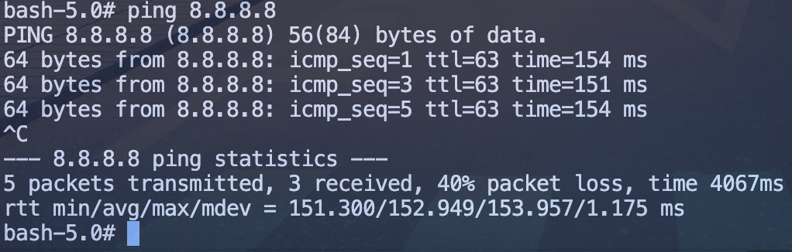
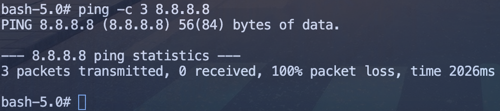
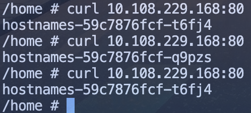
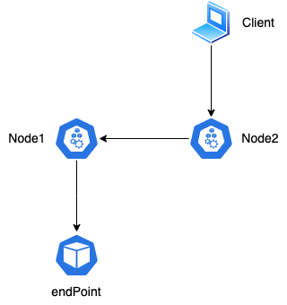

## 引言

本文是《深入剖析 K8s》的学习笔记，相关图片和案例可从[https://github.com/WeiXiao-Hyy/k8s_example](https://github.com/WeiXiao-Hyy/k8s_example)中获取，欢迎 :star:!

## K8s 的网络隔离: NetWorkPolicy

K8s 如何考虑容器之间网络的“隔离” -> NetWorkPolicy

以下是一个 NetWorkPolicy 的定义。

```yaml
apiVersion: networking.k8s.io/v1
kind: NetworkPolicy
metadata:
  name: test-network-policy
  namespace: default
spec:
  # 指定套用 network policy 的 pod
  # 若沒指定 podSelector，就表示將 network policy 套用到 namespace 中的所有 pod
  podSelector:
    matchLabels:
      role: db
  # 設定 network policy 包含的 policy type 有那些
  policyTypes:
    - Ingress
    - Egress
  # ingress 用來設定從外面進來的流量的白名單
  ingress:
    - from:
        # 指定 IP range
        - ipBlock:
            cidr: 172.17.0.0/16
            # 例外設定
            except:
              - 172.17.1.0/24
        # 帶有特定 label 的 namespace 中所有的 pod
        - namespaceSelector:
            matchLabels:
              project: myproject
        # 同一個 namespace 中帶有特定 label 的 pod
        - podSelector:
            matchLabels:
              role: frontend
      ports:
        - protocol: TCP
          port: 6379
  # egress 用來設定 pod 對外連線的白名單
  egress:
    - to:
        - ipBlock:
            cidr: 10.0.0.0/24
      ports:
        - protocol: TCP
          port: 5978
```

> ingress, exgress 的行为

- `ingress` 搭配 from, 负责管理从外部进来的流量
- `exgress` 搭配 to, 负责管理从内部出去的流量

> 设定 Default Policy

- 若要选择所有的 pod，则将 `podSelector` 设定为 {}
- Network Policy 的设定，若是设定 `policyType`，就表示要全部拒绝该种连接(`ingress/egress`)的流量
- 若要打开上面的限制，則要在 `spec.ingress` or `spec.egress` 中设定

凡是支持 NetWorkPolicy 的 CNI 网络插件，都维护着一个 NetWorkPolicy Controller，通过控制循环的方式对 NetWorkPolicy 对象的 CRUD 做出响应，然后在宿主机上完成 iptables 规则的配置工作。

> 案例

```yaml
apiVersion: v1
kind: Pod
metadata:
  name: deny-egress-test
  labels:
    app: "deny-egress-test"
  namespace: "new-ns"
spec:
  containers:
    - name: nettools
      image: travelping/nettools
      command: ["sh", "-c", "sleep 3600"]
```

正常的 pod 可以访问外界。



添加如下 NetWorkPolicy 之后，ping 失败。

```yaml
apiVersion: networking.k8s.io/v1
kind: NetworkPolicy
metadata:
  name: deny-egress-test
  namespace: "new-ns"
spec:
  podSelector:
    matchLabels:
      app: "deny-egress-test"
  policyTypes:
    - Egress
```



> iptables

iptables 相关配置可以参考[https://zh.wikipedia.org/wiki/Iptables](https://zh.wikipedia.org/wiki/Iptables)

## Service、DNS 与服务发现

Service 是由 kube-proxy 组件，加上 iptables 来共同实现的。部署 service 和 deploy 后可发现，其默认提供的是 Round Robin 方式的负载均衡。



```shell
-A KUBE-SERVICES -d 10.108.229.168/32 -p tcp -m comment --comment "default/hostnames: cluster IP" -m tcp --dport 80 -j KUBE-SVC-NWV5X2332I4OT4T3
```

这条 iptables 规则的含义是：凡是目的地址是 10.0.1.175、目的端口是 80 的 IP 包，都应该跳转到另外一条名叫 KUBE-SVC-NWV5X2332I4OT4T3 的 iptables 链进行处理。

`KUBE-SVC-NWV5X2332I4OT4T3` 规则如下：

```shell
-A KUBE-SVC-NWV5X2332I4OT4T3 -m comment --comment "default/hostnames:" -m statistic --mode random --probability 0.33332999982 -j KUBE-SEP-WNBA2IHDGP2BOBGZ
-A KUBE-SVC-NWV5X2332I4OT4T3 -m comment --comment "default/hostnames:" -m statistic --mode random --probability 0.50000000000 -j KUBE-SEP-X3P2623AGDH6CDF3
-A KUBE-SVC-NWV5X2332I4OT4T3 -m comment --comment "default/hostnames:" -j KUBE-SEP-57KPRZ3JQVENLNBR
```

这三条链指向的最终目的地，其实就是三个 Service 代理的三个 Pod。通过查看上述三条链的明细，如下所示：

```shell
-A KUBE-SEP-57KPRZ3JQVENLNBR -s 10.1.0.116/32 -m comment --comment "default/hostnames:" -j MARK --set-xmark 0x00004000/0x00004000
-A KUBE-SEP-57KPRZ3JQVENLNBR -p tcp -m comment --comment "default/hostnames:" -m tcp -j DNAT --to-destination 10.1.0.116:9376
-A KUBE-SEP-WNBA2IHDGP2BOBGZ -s 10.1.0.117/32 -m comment --comment "default/hostnames:" -j MARK --set-xmark 0x00004000/0x00004000
-A KUBE-SEP-WNBA2IHDGP2BOBGZ -p tcp -m comment --comment "default/hostnames:" -m tcp -j DNAT --to-destination 10.1.0.117:9376
-A KUBE-SEP-X3P2623AGDH6CDF3 -s 10.1.0.118/32 -m comment --comment "default/hostnames:" -j MARK --set-xmark 0x00004000/0x00004000
-A KUBE-SEP-X3P2623AGDH6CDF3 -p tcp -m comment --comment "default/hostnames:" -m tcp -j DNAT --to-destination 10.1.0.118:9376
```

上述本质是 DNAT 规则，再 DNAT 规则将流入 IP 包的目的地址和端口，改成 to-destination 所指定新的目的地址和端口（被代理 Pod 的 IP 地址和端口）。

> 注意

当你的宿主机上有大量 Pod 的时候，成百上千条 iptables 规则不断地被刷新，会大量占用该宿主机的 CPU 资源，甚至会让宿主机“卡”在这个过程中。所以说，一直以来，基于 iptables 的 Service 实现，都是制约 Kubernetes 项目承载更多量级的 Pod 的主要障碍。

往往采用 IPVS 技术进行优化，IPVS 并不需要在宿主机上为每个 Pod 设置 iptables 规则，而是把对这些“规则”的处理放到了内核态，从而极大地降低了维护这些规则的代价。

### Service和DNS关系

在K8s中，Service和Pod都会被分配对应的DNS记录。

> ClusterIP模式

`..svc.cluster.local` 解析的是该Service的VIP地址

> Headless模式

`..svc.cluster.local` 解析的是Pod的IP地址的集合

### NodePort

所谓 Service 的访问入口，其实就是每台宿主机上由 kube-proxy 生成的 iptables 规则，以及 kube-dns 生成的 DNS 记录。而一旦离开了这个集群，这些信息对用户来说，也就自然没有作用了。

> 注意

在 NodePort 方式下，Kubernetes 会在 IP 包离开宿主机发往目的 Pod 时，对这个 IP 包做一次 SNAT 操作。

```shell
-A KUBE-POSTROUTING -m comment --comment "kubernetes service traffic requiring SNAT" -m mark --mark 0x4000/0x4000 -j MASQUERADE
```

这条规则设置在 POSTROUTING 检查点，也就是说，它给即将离开这台主机的 IP 包，进行了一次 SNAT 操作，将这个 IP 包的源地址替换成了这台宿主机上的 CNI 网桥地址，或者宿主机本身的 IP 地址

这个 SNAT 操作只需要对 Service 转发出来的 IP 包进行，依据，就是查看该 IP 包是否有一个“0x4000”的“标志”，这个标志正是在 IP 包被执行 DNAT 操作之前被打上去的。

> DNAT和SNAT相关原理

[https://juejin.cn/post/7144679982759936013](https://juejin.cn/post/7144679982759936013)

简单概括即：SNAT是原地址转换，DNAT是目标地址转换。

如果内部地址要访问公网上的服务时，内部地址会主动发起连接，将内部地址转化为公有ip（SNAT）。

当内部需要对外提供服务时，外部发起主动连接，路由器或防火墙的网关接收到这个连接，然后把连接转换到内部，此过程是由带公有ip的网关代替内部服务来接收外部的连接，然后在内部做地址转换（DNAT）。

> 为什么要对流出的包做SNAT呢？

如果客户端通过Node2访问Service，则有可能负载到Node1上的endpoint提供服务，则如果不做SNAT则返回的地址为Node1，会导致client接收包失败（client请求的是Node2，响应是Node1）。

> 不做SNAT可以吗？

可以，在某些场景下，Node1需要知道IP包来自外部的Client而不是Node2，则上述SNAT无法满足需求。可以将`Service.externalTrafficPolicy`设置为`local`，保证了所有Pod通过Service收到请求之后，一定可以“看到”真正的client的源地址。

如果一台宿主器不存在任何被代理的Pod，比如上述的Node2，则使用使用Node2的IP地址访问这个Service则是无效的。



## 参考资料

- [https://godleon.github.io/blog/Kubernetes/k8s-Network-Policy-Overview/](https://godleon.github.io/blog/Kubernetes/k8s-Network-Policy-Overview/)
- [https://zh.wikipedia.org/wiki/Iptables](https://zh.wikipedia.org/wiki/Iptables)
