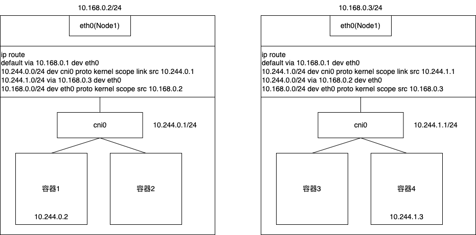
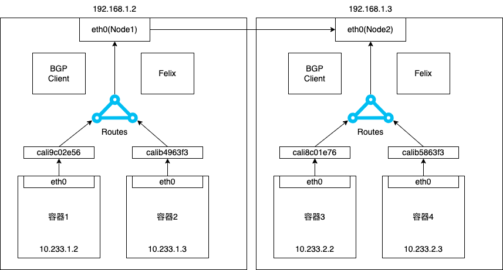
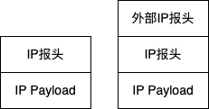

## 引言

本文是《深入剖析 K8s》的学习笔记，相关图片和案例可从[https://github.com/WeiXiao-Hyy/k8s_example](https://github.com/WeiXiao-Hyy/k8s_example)中获取，欢迎 :star:!

上篇主要介绍了 Flannel 插件为例，讲解了 K8s 里容器网络和 CNI 插件的主要工作原理。还有一种“纯三层”的网络方案值得注意。即 Flannel 的 host-gw 模式和 Calico 项目。

## Flannel 的 host-gw 模式

原理图如下:



flannel 使用 host-gw 模式之后，会在宿主机创建一条规则

```shell
10.244.0.1/24 via 10.168.0.3 dev eth0
```

目的 IP 地址属于 10.244.1.0/24 网段的 IP 经过本机的 eth0 发出(`dev eth0`)；并且下一跳的地址是 10.168.0.3(`via 10.168.0.3`)。

一旦配置了下一跳地址，那么 IP 包从网络曾进入链路层封装成帧时，eth0 设备就会使用下一跳的 MAC 地址。这样，这个数据帧就会从 Node1 通过宿主机的二层网络顺序到达 Node2 上。

根据 Node2 上的路由表，该目的地址会匹配到第二条路由规则(10.244.1.0/24)。

这台“主机”充当了这条容器通信路径的网关(host-gw)。

> 说明

host-gw 模式能够正常工作的核心，在于 IP 包在封装成帧发送出去，会使用路由表中的下一跳来设置目的 MAC 地址。要求集群宿主机之间是二层连通的。

## Calico 项目

Calico 项目提供的网络解决方案与 Flannel 的 host-gw 几乎完全一样。也会为宿主机添加一条格式如下的路由规则。

```shell
<目的容器IP地址> via <网关的IP地址> dev eth0
```

不同与 Flannel 通过 etcd 和宿主机上的 flanneld 来维护路由信息，Calico 项目则使用来 BGP(border gateway protocol，边界网关协议)

BGP 是大规模网络中实现节点路由信息共享的一种协议。BGP 协议详解链接：[https://cloud.tencent.com/developer/article/1922673](https://cloud.tencent.com/developer/article/1922673)

> Calico 项目架构组成

1. Calico 的 CNI 插件：这是 Calico 与 K8s 对接的部分
2. Felix：是一个 DaemonSet，负责在宿主机上插入路由规则
3. BIRD：是 BGP 的客户端，专门负责在集群里分发路由规则信息

Calico 原理图如下所示：



由于 Calico 没有使用 CNI 的网桥模式，因此 Calico 的 CNI 插件还需要在宿主机上为每一个容器的 Veth Pair 设备配置一条路由规则，用于接收传入的 IP 包。

```shell
10.233.2.3 dev cali5863f3 scope link
```

发送 10.233.2.3 的 IP 包应该进入 cali5863f3 设备中。

Calico 的 Felix 进程负责维护下一跳路由规则。

> 注意

Calico 实际上将集群里的所有节点都当作边界路由器来处理，共同组成了一个全连通的网络(Node-to-Node Mesh)。但是随着节点 N 的增加，这些连接的数量就会以$N^2$的规模快速增长，从而给集群的网络带来压力。

一般推荐 Node-to-Node Mesh 用于节点少于 100 个的集群里。而在更大规模的集群里使用 Route Reflector 模式。

Route Reflector 模式会指定一个或者几个专门的节点，来负责跟所有节点建立 BGP 连接，从而学习全局的路由规则。实际上是扮演了“中间代理”的角色。

> Calico-考虑两台处于不同子网的宿主机 Node1 和 Node2

同样是 container1 请求 container4，Calico-IPIP 工作原理图如下：


Calico 会在 Node1 上添加一条路由规则

```shell
10.233.2.0/16 via 192.158.2.2 eth0
```

然而 Node1 和 Node2 不在一个子网里，无法通过二层网络 IP 包发送到下一跳地址。

> 解决方案

在 Calico-IPIP 模式下，Felix 进程在 Node1 上添加的路由规则会不同

```shell
10.233.2.0/24 via 192.168.2.2 tunl0
```

使用的 tunl0 设备是一个 IP 隧道设备，会将 IP 包添加一个外部 IP 报头。原理图如下：



### 将宿主机网关也加入 BGP Mesh

由于宿主机属于不同子网(VLAN)，成了更加常见的部署状态。

> 方案一：不推荐

所有宿主机跟宿主机建立 BGP Peer 关系

这种情况要求宿主机支持 Dynamic Neighbors 的 BGP 配置方式。考虑到宿主机数量成百上千。Dynamic Neigbors 允许给路由器配置一个网段，路由器自动和跟该网段的主机建立 BGP Peer 关系，避免手动管理路由器。

> 方案二：推荐

使用一个或者多个独立组件负责搜集整个集群里的所有路由信息，然后使用 BGP 协议同步给网关。

只需要 WATCH ETCD 里的宿主机和对应网段的变化信息，然后把这些信息通过 BGP 协议分发给网关即可。

## 参考资料

- [https://book.douban.com/subject/35424872/](https://book.douban.com/subject/35424872/)
- [https://cloud.tencent.com/developer/article/1922673](https://cloud.tencent.com/developer/article/1922673)
